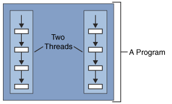
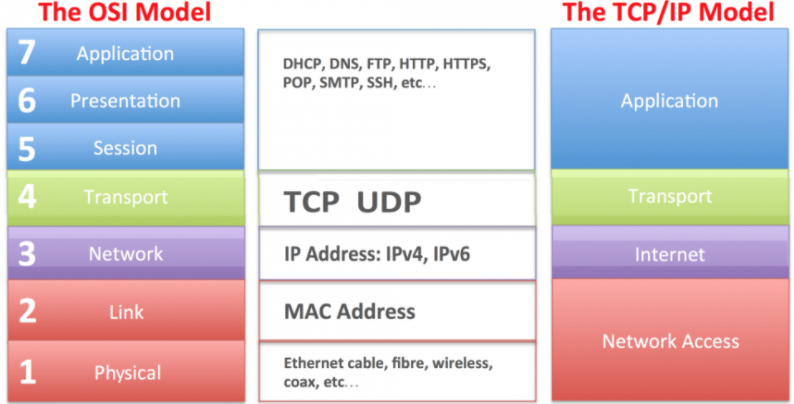

# Laboratorul 1. Programarea in retea

## Tema: Socket / HTTP / Multithreading

1. **Sa se creeze o cerere (request) GET HTTP catre web-serverul website-ului _me.utm.md_ utilizand socket.**
```python
import os
import socket
import re
import ssl
import io


class OpenThroughSocket:
    def __init__(self, host, port):...

    def get_links(self):...
```

2. **Cu ajutorul expresiilor regulate sa se extraga toate imaginile din raspunsul primit din _punctul 1_.**
````python
...
urls = []
for line_in_file in x:
    results = re.findall("[^\"']*\.(jpg|png|gif)", line_in_file)
    for y in results:
        if "https://" not in y:
            y = "https://utm.md" + y
        urls.append(y)
urls = list(set(urls))
self.links_to_images = urls
...
````

3. **Utilizand Socket, HTTP si firele de executii sa se descarce toate imaginile gasite din _punctul 2_ intr-un folder.
Imaginile sa se descarce utilizand maximum 4 fire de executie concomitent.**
```python
import socket
import ssl
import threading
from threading import Thread
from urllib.parse import urlparse
import os


class DownloadImages(Thread):
    def __init__(self, image_list, host, port):...

    def divide_list(self):...

    def download_through_sockets(self, name, list_of_images):...

    def start_multi_threading(self):...

```

### Pentru nota 9 si 10:
* utilizand 4 fire de executie nu mai mult de 2 imagini sa fie salvate in folder in acelasi timp
* programul elaborat trebuie sa functioneze si pentru **utm.md**

### Atentie:
* Sa nu utilizati librarii HTTP, pentru acest laborator. Utilizati sintaxa protocolului HTTP.
* Fiecare cerere GET HTTP sa contina minim 6 antete.
* Pentru _punctul 2_ alegeti doar JPG, PNG si GIF.
* In retea totul este la nivel de octeti asa ca inainte de a scrie in socket asigurati-va ca datele sunt convertite in
octeti.
* Pentru **utm.md** utilizati portul 443, pentru **me.utm.md** portul 80.
* Puteti utiliza semaforul pentru a sincroniza firele de executie.

### Intrebari la apararea laboratorului:
* Ce este un Socket?
    - Un Socket este un punct final al unei legaturi de comunicatie bidirectionala intre doua programe care ruleaza in 
      retea. Un Socket este legat de un numar de port, astfel incat stratul TCP sa poata identifica aplicatia catre care
      datele destinate sa fie trimise.
  
* Scopul protocolului HTTP?
    - HTTP este un protocol pentru preluarea surselor, cum ar fi documentele HTML. Este baza oricarui schimb de date pe
      Web si este un protocol client-server, ceea ce inseamna ca cererile sunt initiate de catre destinatar, de obicei
      browserul Web.
  
* Ce este un fir de executie?
    - Un fir de executie este o succesiune secventiala de instructiuni care se executa in cadrul unui proces.
      
  
* Diferenta dintre TCP si UDP
    - TCP este un protocol orientat pe conexiune, in timp ce UDP este un protocol fara conexiune. O diferenta importanta
      intre aceste protocoluri este viteza, deoarece TCP este comparativ mai lent decat UDP. In general, UDP este un
      protocol mult mai rapid, mai simplu si eficient, cu toate acestea, retransmiterea pachetelor de date pierdute este
      posibila numai cu TCP.
  
* Ordinea in care octetii sunt secventiati in retea?
    - In mediul TCP/IP, adresele IP trebuiesc definite din punct de vedere al arhitecturii masinilor. Unele arhitecturi
      de masini definesc cea mai mica adresa de memorie ca fiind bitul de ordin inalt, care se numeste _big-endian_. Cu
      toate acestea, alte arhitecturi definesc cea mai mica adresa de memorie ca fiind bitul de ordin scazut, fiind
      numit little-endian.
    - Adresele de retea dintr-o retea data trebuie sa urmeze toate o conventie de adresare consecventa. Aceasta
      conventie (ordinea secventierii octetilor in retea) defineste ordinea de biti a adreselor de retea pe masura ce
      ce acestea trec prin retea. Ordinea de octeti a retelei standard TCP/IP este big-endian. Pentru a participa la o
      retea de tip TCP/IP, sistemele little-endian trebuiesc sa fie convertite la ordinea octetilor in retea.
  
* Cele patru nivele ale stivei TCP/IP si sapte nivele ale modelului OSI
    
  
* Din ce cauza nu puteti transmite cereri HTTP website-ului **utm.md** utilizand portul 80?
    - Cauza din care nu o sa reusim sa transmitem cereri HTTM website-ului **utm.md** utilizand portul 80, este ca
      cererile HTTP simple vor incerca sa comunice cu un port de server SSL-compatibil. Va fi necesar sa folosim o
      schema HTTPS compatibila pentru aceasta adresa.
  
* Cum se creeaza o conexiune Socket?
    - O conexiune Socket se creeaza cu ajutorul informatiei despre protocolul si adresa de retea utilizata. La 
      initializarea unei entitati de clasa Socket se vor indica parametrii specifici: tipul adresei de retea (ex. IPv4)
      si tipul de socket (ex. TCP).
  
* Cum se transmit date intr-un Socket?
    - In limbajul de programare Python se utilizeaza metoda _send()_ pentru a transmite datele de la un Socket la altul.
 
* Cum se citesc datele dintr-un Socket?
    - Datele dintr-un Socket se citesc cu ajutorul metodei _recv(bufsize)_. Aceasta va returna un obiect de tip byte, 
      ceea ce reprezinta datele primite. Capacitatea maxima de date ce vor fi primite este specificata de parametrul
      _bufsize_.
  
* Care sunt metodele HTTP?
    - GET - metoda GET este folosita pentru obtinerea datelor de la o resursa.
    - HEAD - metoda HEAD, la fel ca si GET, se foloseste pentru obtinerea datelor de la o resursa, dar fara
      _response body_.
    - POST - se folosete pentru trimiterea datelor intregi catre o resursa.
    - PUT - se foloseste pentru inlocuirea unei resurse.
    - DELETE - sterge o anumita resursa.
    - OPTIONS - este folosita pentru afisarea parametrilor conexiunii cu resursa.
    - PATCH - se foloseste pentru inlocuirea unor secvente dintr-o anumita resursa.

* Codurile de stare HTTP (200, 301, 302, 401, 404, 405, 500)
    - **200** - cerere efectuata cu **succes**.
    - **301** - documentul cerut a fost mutat permanent pe o alta adresa.
    - **302** - documentul cerut a fost mutat temporar pe o alta adresa.
    - **401** - sursa este blocata pentru utilizatorii neautorizati. Pentru acces este necesara autentificarea.
    - **404** - pagina nu a fost gasita conform adresei indicate de utilizator.
    - **405** - metoda indicata de utilizator nu este permisa pentru aceasta resursa.
    - **500** - eroare aparuta pe server.
  
* Ce este HTTP securizat?
    - Protocolul HTTPs securizat (HTTPS) este criptat pentru a spori securitatea transferului de date. Este importanta
      utilizarea HTTPS cand utilizatorul transmite date senzitive, cum ar fi logarea in conturi bancare, servicii email
      si etc.
  
* Diferenta dintre Socket si WebSocket
    - Websocket se numeste tehnologia pentru conexiunea la o resursa in timp real (live-communication), pe cand Socket
      este o librarie pentru utilizarea Websocket-urilor.
  
* Diferenta dintre un proces si fir de executie
    - Procesul inseamna un program in executie, in timp ce un fir de executie inseamna un segment a unui proces
    - Crearea unui proces dureaza mai mult decat crearea unui fir de executie. La fel ce tine de terminarea lor.
    - Procesele nu pot face schimb de date intre ele, in timp ce firele de executie pot imparti date intre ele. 
* Ce este un Deadlock si cand el apare?
    - Deadlock reprezinta sistuatia in care niciun membru al unui grup de entitati nu poate continua, deoarece
      fiecare asteapta ca un alt membru sa ia masuri, de exemplu: transmiterea unui mesaj sau eliberarea unui blocaj.
    - Intr-un sistem de comunicatii, deadlock apare in principal din cauza pierderii sau coruperii semnalelor.
  
* Pentru ce este nevoie de metoda _join()_ in programarea multithreading?
    - _join_ este moetoda de sincronizare care blocheaza firul de executie ce este apelat pana la finalizarea firului
      de executie ce este apelat. Apelantul se va bloca pe termen nelimitat daca firul de executie nu se termina.