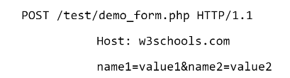

# Laboratorul 3. Programarea în rețea

## Tema: HTTP Client

**Să se creeze o aplicație client HTTP**

### Pentru nota 7-8:
* Cererile HTTP să fie făcute prin intermediul unui proxy
* Să se utilizeze expresiile regulate

### Pentru nota 9 si 10:
* Să se utilizeze firele de execuții și tehnici de sincronizare
* Clientul trebuie să se poată autentifica pe resursă utilizînd cookies

### Atenție:
* Pentru acest laborator utilizați librării HTTP deja existente, nu este necesar de a utiliza Socket
API. Cine dorește poate să facă prin socket ca și la primul laborator.
* Clientul trebuie să facă cereri GET, POST, HEAD și OPTIONS
* Aplicația poate fi consolă sau GUI
* Nu sunteți limitați la funcțional, resura(pagina web) la care clientul o să facă cereri HTTP este
la alegere.
* Vă recomand să folosiți proxy private și nu free: https://proxy-seller.com
* Aplicația elaborată trebuie să posede o logică bine definită

### Întrebări la apărarea laboratorului:
* Cum este formatat corpul unei cereri HTTP pentru o cerere HTTP de tip POST ?

---
* De unde știe un client HTTP ce tip de conținut trimite serverul HTTP ?
 - In raspunsul serverului gasim Content-Type=Tipul_Continutului
* Cum decide un client dacă ar trebui să aibă încredere în certificatul unui server ?
 - Prin verificarea certificatului SSL 
* Care este problema principală cu certificatele autosemnate ?
- Browserele vor avertiza utilizatorii cu privire la autenticitatea serverului pe care incearca sa se
conecteze, iar pentru volum mare de date si date sensibile (datele cardului bancar) este recomandat de
procurat un certificat autorizat. 

* Conexiunea persistentă HTTP – care sunt principalele beneficii ?
 - Procesorul este mai putin incarcat, de asemenea si consumul de memorie. 
 - Nu trebuie de creat o conexiune noua. 
 - Micsoreaza posibilitatea de supraincarcare a retelei. 
 - Se poate de utilizat HTTP pipelining.
 - Erorile HTTP se itroc fara icheirea conexiunii.

* Ce este negocierea conținutului în HTTP și cum are loc ?
 - Daca un client nu are cunostinte despre suportul unui server pentru HTTP / 2.0, acesta incepe cu
HTTP / 1.1 si incearca 0 actualizare la HTTP / 2.0 dupa cum urmeaza:
GET /default.htm HTTP/1.1
Host: server.example.com
Connection: Upgrade
Upgrade: HTTP/2.@
Daca serverul nu accepta noul protocol, acesta va raspunde pur si simplu clientului folosind HTTP /
1.1:
HTTP/1.1 206 OK
Content-length: 243
Content-type: text/html
Daca serverul trece la noul protocol, acesta va semnaliza printr-un raspuns 101. Serverul trece la
HTTP / 2.0 imediat dupa linia goala care incheie raspunsul 101 [I-D.ietf-httpbis-p2-semantics].
HTTP/1.1 101 Switching Protocols
Connection: Upgrade
Upgrade: HTTP/2.@
[ HTTP/2.0 frame ] 

* Care sunt tipurile de negociere a conținutului HTTP ?
 - Abbreviated handshake
 - A full handshake 

* Ce este un ETag în HTTP și cum funcționează ?
 - Antetul de raspuns HTTP ETag este un identificator pentru o verstune specifica a unei resurse.
Acesta permite la cache sa fie mai eficient si s4 economiseasca latimea de banda, deoarece un server web nu
trebuie si retrimit’ un rispuns complet daca continutul nu s-a schimbat. In plus, etagurile ajutd la prevenirea
actualizarilor simultane ale unei resurse si evita suprascrierea reciproca ("mid-air collisions”). 

* Diferența dintre protocoalele fără stare și cele cu stare. Cărui tip îi aparține HTTP ?
 - HTTP este un protocol cu stare.
Protocoalele cu stare se mai numesc si link-state routing algorithm, sunt protocoale cu preferarea
drumului minim (SPF shortest path first),mentin o baz4 de date complexa a topologiei retelei. Spre deosebire
deprotocoalele fara stare, ele folosind starea legaturilor dezvolta si intretin 0 cunoastere completa a
routerelor de retea, ca si a felului cum sunt interconectate acestea. 

* Avantajele cheie ale HTTP/2 în comparație cu HTTP/1.1
 - HTTP/2 creste considerabil viteza de incarcare a site-urilor pe desktop si pe telefoanele mobile,
reduce consumul de trafic internet, ofera securitate sporita si alte facilitati.

* Ce este un tip MIME, din ce constă și pentru ce se folosește ?
 - MIME este un stardat care indica natura si formatul documentului, fisierului sau colectiei de biti.
Este definit si standardizat in IETF's RFC 6838. 

* Care este diferența dintre GET și POST ?
1. Folosind GET, informatia transmisa de la utilizator este incarcata in url, pe cand cea de la
POST nu este in url, ea este transmisa prin conexiunea curenta http. Astfel, un url la care a fost transmisa 0
cerere POST nu se poate salva pentru o accesare ulterioara.
2. Folosind GET, lungimea datelor primite de la utilizator este limitata la aproximativ 255 de
caractere, lungimea maxima a unui URL. Astfel, formulare care accepta mesaje, sau incarcare de fisiere, sau
informatie mai lunga, NU se pot transmite prin GET.
3. Datorita faptului ca informatiile de la utilizator se transmit prin url in cazul metodei GET, nu
putem transmite prin GET informatiile dintr-un formular care are parola, pentru ca, parola va fi
vizibila in URL. Decat daca codam parola respectiva. 

* Care este diferența dintre PUT și POST ?
1. Metoda PUT este apelata atunci cand trebuie sA modificati o singura resursa, in timp ce metoda
POST este apelata atunci cand trebuie s4 adaugati o resursa copil.
2. Raspunsul metodei PUT poate fi memorat in cache, dar nu puteti memora in cache raspunsurile
metodei PUT.
3. Puteti utiliza interogarea UPDATE in PUT, in timp ce puteti utiliza crearea interogarii in POST.
4. {in metoda PUT, clientul decide ce resursi URI trebuie sa aiba, iar in metoda POST, serverul decide
ce resursd URI trebuie sa aiba.
5. PUT functioneaza specific, in timp ce POST functioneaza abstract.
6. Daca trimiteti aceeasi solicitare PUT de mai multe oni, rezultatul va ramane acelasi, dar daca trimiteti
aceeasi cerere POST de mai multe ori, veti primi rezultate diferite.
7. Metoda PUT este idempotenta (neschimbata), in timp ce metoda POST nu este idempotenta
(neschimbate).

* Care sunt metodele idempotente în HTTP și care sunt scopul lor.
 - Metodele idempotente in HTTP sunt: OPTIONS, GET, HEAD, PUT, DELETE.
Mai multe cereri identice vor conduce la returnarea aceluiasi raspuns (aceeasi reprezentare) 

* Cum sunt identificate resursele în protocolul HTTP ?
 - <protocol>://<nume_DNS>/<nume_local>
® protocol - este protocolul folosit (de cele mai multe ori http),
® nume_DNS - este numele domeniului pe care se afla resursa,
© nume_local - este format din calea si numele resursei de pe discul local. 

* Care sunt metodele sigure și nesigure în HTTP ?
 - Sigure: Get, Head
 - Nesigure: Post, Put, Delete

* Pentru ce este nevoie de cURL ?
 - Pentru aefectua HTTP request-uri din consola, este de asemenea utilizat in ecipamente pentru
automobile, rutere, televizoare ... 
