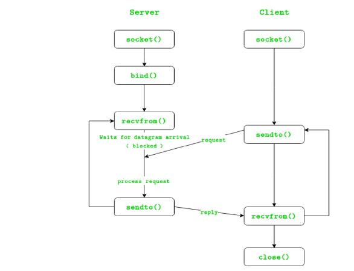

# Laboratorul 5. Programarea în rețea

## Tema: Aplicatie Client-Server UDP 

**Sa se creeze 0 aplicatie Client-Server UDP utilizand Socket API**

### Pentru nota 9 si 10:
* Sa se ordoneze datagramele primite de catre server
* Sa se creeze GUI(Graphical User Interface) pentru aplicatie

### Atentie:
* Nu se admite aplicatii simple de genul Echo Client-Server

### Intrebari la apararea laboratorului: 
* Ce este un protocol orientat catre tranzactii, fara conexiune ?
  - Protocolul orientat catre tranzactii, fara conexiune, reprezinta un protocol care nu asteapta raspuns de
la client, adica nu tine cont de pachetele pierdute, daca internetul este de calitate buna atunci pachetele o sa
fie transmise toate cu bine, daca conexiunea este rea atunci o sa fie pierderi de pachete.

* Ce tipuri de aplicatii beneficiaza in general de utilizarea protocolului UDP ?
  - Aplicatii de live streaming, Jocuri live, aplicatii comunicare cum ar fi skype.

* De ce protocolul UDP nu garanteaza ca datele vor fi transmise cu succes ?
  - Nu tine cont de paketele pierdute, astfel pot aparea anumite pierderi de date.

* Diferenta dintre blocking si non-blocking sockets
  - Blocking sockets: presupune faptul ca doar un singur soacket poate fi deschis in orice moment in trun thread, nu este la fel de eficient ca non-blocking fiindca avem nevoie de un nou fir de executie pentru
fiecare socket.
  - Non-blocking sockets: putem gestiona un numar mult mai mare de clioenti

* in protocolul TCP exista Three Way Handshake, de ce in UDP nu exista ?
  - UDP nu gestioneaza pachetele in vre-un fel, el doar expediaza datele catre destinatar, de asemenea
Header-ul UDP difera de HEADER-ul TCP 

* Numiti cele 2 apeluri de sistem necesare pentru a crea un server UDP

   
---

* Care este rolul metodei bind() ?
  - Leaga socketul de adresa Serverului

* Care este rolul metodelor sendto() si reevfrom() ?
  - sendto() Trimiterea datelor catre client sau server, recvfrom() primirea datelor de la server sau client

* Care este dimensiunea antetului unui pachet UDP in octeti ?
  - 4 octeti

* Intr-o conexiune UDP, clientul sau serverul trimite mai intai datele ?
  - Clientul trimite datagrama.

* Care este adresa de loopback IPv6 si care este rolul ei ?
0000: 0000 : 0000 : 0000 :0000 : 0000 : 0000 : 0001/128 sau. ::1/128
  - O interfata loopback este utila pentru sarcinile de depanare, adica un nod trimite packete catre sine
insusi.

* De unde stie un sistem de operare ce aplicatie este responsabila pentru un pachet
primit din retea ?
  - Prin intermediul setarilor firewall, Prin folosirea unui firewall avem posibilitatea de a seta exceptii
sau de a bloca traficul de date al anumitor aplicatii in functie de caz. Din headerul packetului.

* Datele primite prin recvfrom() au intotdeauna aceeasi dimensiune cu datele trimise cu
sendto() ?
  - Depinde de calitatea conexiunii la internet, daca conexiunea este buna atunci dimensiunea va fi la fel
daca conexiunea este rea atunci dimensiunea v-a fi diferita

* Este acceptabil sa inchei executia programului daca este detectata o eroare de retea ?
  - Daca afisam 0 eroare inainte de a inchide programul.

* De ce nu este folosit algoritmul Nagle in protocolul UDP ?
  - Deoarece este un algoritm de imbunatatire a protocolului tcp/ip

* Ce instrumente listeaza socket-urile UDP deschise in sistemele de operare Windows si
Linux ?
  - Linux- ss, netstat | grep "udp"
  - Windows- netstat -an | find "UDP” | more

* Acelasi program poate folosi UDP si TCP ?
  - Da

* Diferenta dintre aplicatii UDP Unicast, Broadcast, si Multicast
  - Unicast — point to point
  - Multicast — point to multiPoint
  - Broadcast — point to all points

* Ce face mai usor multiplexarea cu UDP decit cu TCP ?
  - Fiindca UDP nu tine cont de packetele expediate in retea pe cand TCP conexiunea persista intre
packete.

* In protocolul UDP este un antet ,,Total length”, cum se calculeaza si care este rolul lui ?
  - Numarul de octeti in datagramme, cu antetul >8 

